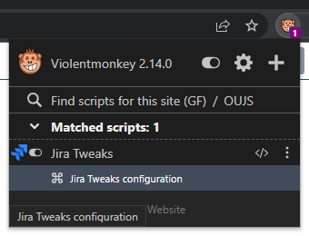

# Jira Tweaks

This is a simple [userscript](https://en.wikipedia.org/wiki/Userscript) to add some basic tweaks to [Jira](https://www.atlassian.com/software/jira).

### Features

* Automatically changes activity items order to Oldest first.
* Autoamtically loads (expands) all newer activity items.
* Adds a floating button at the right bottom corner to quickly scroll to the top or bottom of the issue.

All features can be switched on and off using the extension meniu item "Jira Tweaks configuration" (screenshot from [Violentmonkey](https://violentmonkey.github.io/)):

### How to install

1. Install userscript manager of your choise, like [Tampermonkey](https://www.tampermonkey.net/) or [Violentmonkey](https://violentmonkey.github.io/).
2. Open raw Jira-Tweaks.user.js file on github.com, a direct link: [https://github.com/Cigaras/Jira-Tweaks/raw/main/Jira-Tweaks.user.js](https://github.com/Cigaras/Jira-Tweaks/raw/main/Jira-Tweaks.user.js).
3. Userscript manager should pick it up automatically, just confirm the installation.